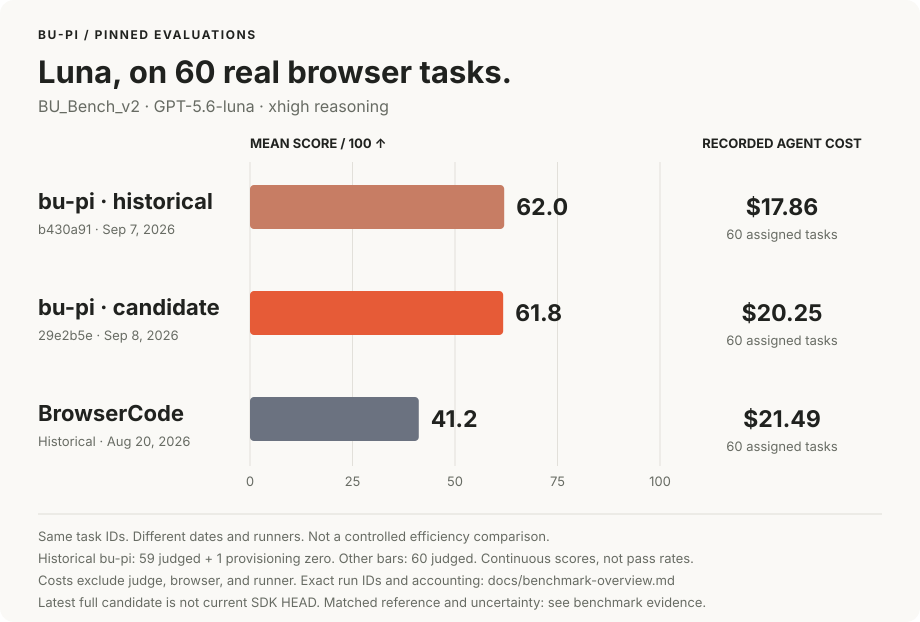

# bu-pi

**Browser Harness-style freedom. A TypeScript SDK you can build on.**

Give Luna a browser, a persistent JavaScript workspace, and a task. It writes code, inspects the result, and adapts its helpers as it goes. Your app gets typed results, files, and a session it can keep talking to.

Pi runs the agent loop. Raw CDP controls Chrome. bu-pi connects them with a small application API.

**Prototype · v0.1.0 · Node.js 22.19+ · MIT · Not published to npm**

```ts
import { BrowserUse, Type } from '@browser-use/next';

const agent = await BrowserUse.create({ model: 'openai/gpt-5.6-luna' });
try {
  const result = await agent.run('Compare three travel chargers under $100.', {
    schema: Type.Array(
      Type.Object({
        name: Type.String(),
        price: Type.Number(),
        source: Type.String(),
      }),
    ),
  });
  if (result.status === 'completed') console.table(result.output);
} finally {
  await agent.close();
}
```

## Why this exists

The model can write a helper once, use it across pages, and repair it when the page changes. JavaScript bindings and extracted data stay alive between turns. A batch of browser operations can run in one tool call; a result already in memory can go straight to your app without the model retyping it.

| Starting point                                                    | What you get                                                                                                                  |
| ----------------------------------------------------------------- | ----------------------------------------------------------------------------------------------------------------------------- |
| [Browser Use](https://github.com/browser-use/browser-use)         | The Python library's `Agent` loop and browser action interface.                                                               |
| [Browser Harness](https://github.com/browser-use/browser-harness) | An editable browser tool for an existing coding agent such as Codex or Claude Code.                                           |
| **bu-pi**                                                         | A standalone TypeScript agent SDK: Pi + persistent JavaScript + raw CDP, with sessions, typed delivery, hooks, and streaming. |

bu-pi consumes upstream Pi packages. There is no Pi fork, Playwright layer, or separate browser daemon. You can extend the browser helpers in ordinary code and still call CDP directly. Repair is something the model does after observing a failure; it is not a guarantee that every task succeeds.

```text
Your app -> BrowserUse -> Pi -> Luna / your model
                 |              |
                 +<- JavaScript-+
                        |
                  persistent V8
                    /       \
               workspace   raw CDP -> Chrome
```

[Design decisions](docs/architecture.md) · [API reference](docs/api.md) · [Migration scope](docs/migration.md)

## Measured, with the runs attached



**62.0/100 on BU_Bench_v2 with Luna xhigh**, at evaluated commit `b430a91`. That is a continuous mean across 60 assigned tasks, including one browser-provisioning zero. BrowserCode's historical run scored 41.2/100 on the same task IDs. Both cost totals are recorded estimates for agent inference, excluding judge, browser, and runner charges.

These are nonconcurrent development runs, not a controlled speed/token-efficiency comparison or a SOTA claim. The chart belongs to its pinned commits; newer runtime experiments are evaluated separately. Hard106 uses **GPT-5.5 medium**: the historical peak was **91/106**, followed by **86, 88, and 85/106** in later full cohorts.

The fresh Hard106 pair at `f41c5b7` scored **89/106 versus 79/106** for the reference, with all 212 judgments. It cleared the frozen noninferiority margin; recorded agent inference cost was **$131.89 versus $117.87**. [Full paired results and uncertainty](docs/iteration-protocol.md#complete-fresh-hard-comparison). The fresh Luna pair scored **57.17/100 versus 58.72/100**, missing the frozen target; three provider failures lack actual judgments. Later SDK commits remain separate.

[Chart data, accounting, and limitations](docs/benchmark-overview.md) · [Full results](docs/vision-results.md) · [Hard106 history](docs/benchmark.md) · [Current experiment protocol](docs/iteration-protocol.md)

## Try it

Clone the source branch and run the local demo:

```sh
git clone --branch codex/raw-cdp-k7m2 https://github.com/browser-use/bu-pi.git
cd bu-pi
npm ci
# Install Google Chrome, or attach an existing CDP endpoint.
npm run demo
```

The demo uses **scripted model responses and a real Chrome browser** against a local fixture. It exercises the complete Pi loop, persistent code, browser interactions, screenshots, artifacts, and typed output. It makes no paid provider request. The SDK, demo, and tests launch installed Google Chrome with a fresh temporary profile.

For an actual model run, configure the provider key (for example `OPENAI_API_KEY`), then:

```sh
MODEL=openai/gpt-5.6-luna node examples/research.mjs "Find the latest stable Node.js release on nodejs.org."
```

Optional environment variables: `MODEL`, `BROWSER_CDP_URL`, and `BROWSER_CHANNEL`. Real model runs incur provider charges. Browser provisioning is explicit; this SDK does not create paid cloud sessions.

## Continue the work

```ts
const agent = await BrowserUse.create({
  model: 'openai/gpt-5.6-luna',
  workspace: './work/research',
  browser: { profileDir: './profiles/research' },
  log: 'pretty',
  recording: true,
});
try {
  await agent.run('Find the products that match my brief.');
  await agent.followUp('Save those products as a CSV.');
  console.table(await agent.files());
  await agent.saveHistory();
} finally {
  await agent.close();
}
```

Persistent profiles keep login state. Workspaces keep ordinary files. Follow-ups keep the conversation and live JavaScript. Stream events, pause before the next tool, inspect the browser, steer, and resume. Export a captured run as an MP4 or GIF without repeating its browser actions.

[Sessions & login](docs/sessions.md) · [Streaming & hooks](docs/events.md) · [Video](docs/recording.md) · [Python](docs/python.md)

Run `npm run demo:session` for a scripted-model/real-browser demo with CSV, history, MP4 and GIF output. Requires Chrome and ffmpeg; no paid model requests. The Python wheel bundles this same JS engine; Node 22.19+ remains a prerequisite.

## What is included

- **Pi models and tools.** Provider/model IDs, reasoning, native events, and custom typed tools.
- **Persistent JavaScript.** Real top-level bindings and `await`; native V8 REPL semantics.
- **Browser capability.** Accessibility discovery, coordinate clicks, frames, shadow DOM, screenshots, uploads, download events, page evaluation, and explicit CDP commands.
- **Typed delivery.** Return existing JavaScript values without rewriting them; schema-validated results; incomplete, cancelled, timed-out, and failed runs stay distinct.
- **Explicit control.** One active operation per session; step/time/context limits and a soft estimated-cost threshold.
- **Recovery.** One budgeted delivery repair for unfinished answers. Worker termination contains hangs. Reconnect to the primary tab without replaying failed actions.
- **Context and recovery.** Upstream Pi compaction, output checkpoints, browser-independent JavaScript/files, and optional Pi coding tools. Nonblocking observers cannot override policy hooks.

## Documentation

```sh
npm run docs:dev
```

Open the printed localhost URL. The docs include quickstart, providers, typed extraction, browser recipes, tools/events, limits, recovery, architecture, migration, and verification. Search and model-specific copyable examples work locally.

## Develop and package

The full browser/video test suite requires installed Chrome and ffmpeg. Python tests require the local Python environment described in [verification](docs/session-verification.md).

```sh
npm run check
npm test
npm run docs:build
npm pack
```

Install the resulting `browser-use-next-0.1.0.tgz` in a separate application. The package exports compiled ESM and TypeScript declarations and has no dependency on the surrounding eval platform.

## Execution boundary

The worker is **not a security sandbox**. Model-generated Node code can access the filesystem and network. Provider environment variables are not inherited by the worker, but this does not isolate host files. Run untrusted tasks in containers/VMs with restricted mounts and accounts. Custom application tools must honor cancellation. Artifacts remain after cleanup; your application owns their retention.

Versioned transcript restore is supported; arbitrary live JavaScript state is not serialized. Cloud provisioning, stealth guarantees and a hosted service are outside this package. Automatic context compaction uses upstream Pi; optional coding tools and recovery behavior are described in [reliability](docs/reliability.md). Existing Python Browser Use users and persisted sessions are unaffected.
